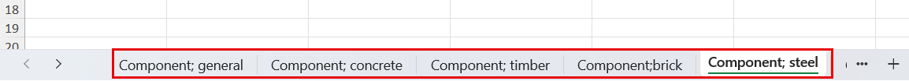
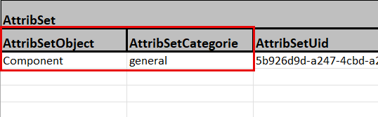
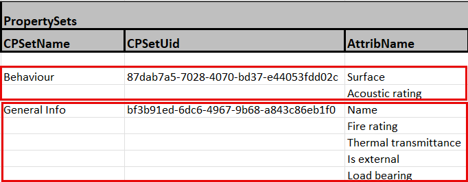
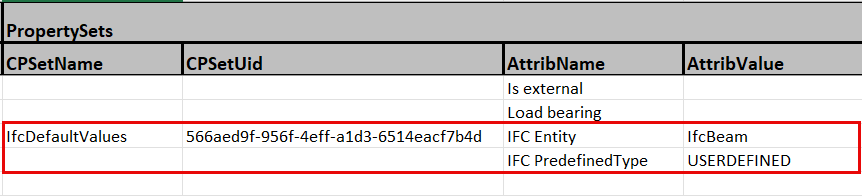
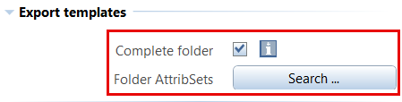
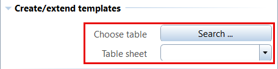
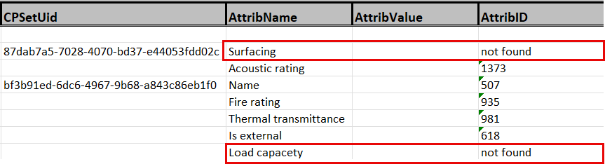

# PythonPart AttribSetHandling
Since several Allplan versions it is possible to group attributes individually and assign them more or less automatically to selected objects in using so called **AttributsetTemplates** which are part of the project settings. With this PythonPart it is possible to edit such templates directly in Excel. It offers different options:
- **read** and **modify** already existing templates
- **add** aditional sets to already existing templates
- **create** completely new templates

This is possible both for single or a whole bunch of AttributSets.

## Installation
The PythonPart **AttribSetHandling** can be installed directly from the Plugin Manager in ALLPLAN. 

Alternatively, the corresponding ***.allep** package can be downloaded from the [release page](https://github.com/AnkeNiedermaier/attrib-set-handling-public/releases). ***.allep** files are ALLPLAN internal setups that can be installed via drag and drop into the program window.

At least the version 2026 is needed to install the PythonPart.

## Installed PythonPart Scripts
If the installation was successfull, the PythonPart **AttribSetHandling.pyp** can be found
in the ALLPLAN Library:
`Office` → `ALLPLAN GmbH` → `AttribSetHandling`

## Excel template
When reading off and exporting AttributsetTemplates it is possible to either **add them** to an already exising file or **create a new** independend one. It will be structured according to the requirements of the PythonPart.

Therefor NO predefined Excel template is installed with the PythonPart, as it can easily be created when running the export for the first time. Afterwards it can be copied and used for additional Attributsets.

Within the file, new sheets can be created, existing ones deleted and the content modified.

> ⚠️IMPORTANT\
The schema and structure of the Ecxel file is fixed and predefined and should not be changed, otherwise the PythonPart will not run correctly!

There is an individual sheet for each "assignment rule" which best should be named "**Attributset-Object; Attributset-Category**"

Both parameters also have to be entered within the first empty row in the correspondend columns. Already existing UID values can be kept, but there is no need to create them manually in new sets, as they will be added automatically during the runtime of the PythonPart.

In the following row the **name of the AttributGroup (CPSet)** in which the related attributes are combined should be entered in the **CPSetName** column. The cell for the UID can also stay empty and will be completed from the PythonPart.

Finally all desired attributes are entered row by row in the column **AttribName**, where the first one has to be in the same row as the name of the **AttribGroup**. The only required information for an attribute is its **Name**, as the ID and UID can also be completed by using the corresponding PythonPart functionality.

Using these principles any amount of additional groups and attributes can be entered.

> ⚠️IMPORTANT\
It is not allowed to leave empty rows between the single groups as this will be interpreted by the PythonPart as end of the content/list!

If the Attributset should include the assignement of an IfcEntity and a PredefinedType, a group with the name **IfcDefaultValues** has to be created. It contains the two attributes **IFC Entity** and **IFC PredefinedType**. In contrast to all other attributes it is also possible to enter a value here in the column **AttribValue**.

> ⚠️IMPORTANT\
tips to work with the Excel tables:
> - it is possible as well to create **new** rows and sheets as to **complete** or **modify** existing ones
> - rows that are not necessary can be **deleted** but it is important that **no empty rows** occure
> - generally speaking it is not necessary to enter **IDs** and **UIDs**, they will be completed automatically
> - only the attributes IFC Entity and IFC PredefinedType allow for the **entry of a value**

## Workflow
The PythonPart is executed directly in ALLPLAN from the **Library palette**. In general, all PythonParts can be stated either with a **double-click** on the entry or per **Drag and Drop**. This shows the corresponding Properties palette and executes the skript.\
he pallett consists of the two main parts
- **Export templates** for the export to Excel
- **Create/extend templates** for completion and creation of the ALLPLAN templates

which can be used independendly. Nevertheless, as a first step it is recommended to export an already existing Attributset in creating a new Excel file. This file can than be used as a **schema** for all following steps.

### Read templates
To export existing templates the button **Folder AttribSets/AttribSet File** opens the Windows Explorer to select the path of the corresponding files. Depending on the setting of the **Complete folder** parameter, either the selected file or the complete folder is read off.

Depending on the choice of **Excel table** either a **new file** will be created or an **existing one** completed with new templates during the export. The button **Select table** therefor either serves to enter a file name and path or select an already existing file.

The export as such is executed with the button **XML templates -> read off**.

### Edit templates
Afterwards the created or completed Excel file can be copied and edited in following the instructions in the **Excel templates** section of the documentation.

### Complete templates
In preparation for the (re)creation of Attributsets the Excel file as the basis has to be completed with the necessary information about the UIDs and IDs of groups and attributes. To do so, the file is selected with the button **Choose table**. Once selected, all containing sheets will be displayed in the **Table sheet** Pull-down. The completion is either possible for one or **all** sheets in one go.

During the completion, depending on the selected **language** all attribute files of the ALLPLAN standard (Etc folder), the office standard (Std folder) and the currently open project will be considered.\
Therefor is is necessary to open the intended project BEFOR running the PythonPart.\
The process as such is executed with the button **Excel table -> complete!**. If it is not possible to complete an ID or UID, for example if there is a misspelling in the name, the entry **"not found"** is entered in the cell instead. Therefor it is recomended to check the Excel file after completion for such errors.

### Create templates
Similar to the completion workflow, the related Excel file and the desired **Table sheet** or **all** existing ones are also selected with the **Choose table** button.
All created files will be stored in the same path as the Excel file but in a **separte sub-folder**. The field **template name** provides an option to enter a name for this folder. If left empty, it will be named **AttribSets**.

Finaly the creation and storage is executed with the **XML templates -> create** button.\
To use them in ALLPLAN than, either the complete folder or the single files have to be copied into the **office standard** (Std folder) and the sub-folder **XML -> AttribSets**.

> ⚠️IMPORTANT\
When opening or switching between projects, their is always an update and synchronistation of the assigned **AttributsetTemplate** from the Std folder. Therefor the only thing to do is to copy the new ones to the office standard as they will be taken over to the projects automatically.

## Video
